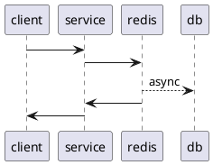

# Архитектурное решение по кешированию

>  Операторам важно видеть самые новые заказы, потому что от этого зависит их вознаграждение, — кто взял заказ, тот и получит оплату.

Т.к. неотъемлемой частью бизнес процесса является отображения новых заказов, то именно они и будут кэшироваться.
Клиентское кэширование не подойдет, по причине того, что есть риск не отобразить актуальные данные, из-за чего 
операторы потеряют оплату.

Таким образом на сервисе для заказов, будет реализовано кэширование, где в качестве ключа - идентификатор оператора,
значение - его активные заказы.

За счет того, что для кэша важны скорость передачи и консистентность данных, то необходимо использовать
паттерн кэширования использовать "Write-Behind".

В качестве инвалидации вероятно, лучше подойдет "программная инвалидация", т.к. бизнес процессы со временем
могут сильно усложниться, а данный способ инвалидации позволит гибко реагировать на эти изменения со стороны ППО.

Следующим вариантом инвалидации - "инвалидация основанная на запросах", т.к. система предоставляет оформлять заказы
и действия происходят уже после "оформления заказа", т.е. после выполнения запроса, данный вариант тоже имеет место быть,
но находится с приоритетом №2.

# Работа над ошибками

## Sequence diagram
